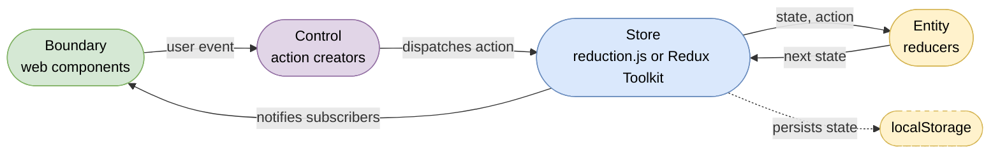

# Building web apps with Web Components, redux and lit-html

This repository hosts the "events" application which was developed during the
[WebComponents with lit-html and redux](http://webcomponents-with-redux.training)
workshop.

New to Web Standards? Checkout: http://webstandards.training

New to Web Components? Checkout: http://webcomponents.training

Never built an app? Checkout: http://effectiveweb.training

Migration to redux toolkit: https://vimeo.com/ondemand/redux

Checkout all online workshops: https://airhacks.io

## The events application

A single-page application for maintaining conference and workshop events: create an
event through a form with native validation, list and filter all events, select rows
for editing or deletion, and preview the selected event as copy-pastable
[schema.org](https://schema.org) microdata. The entire state is persisted to
localStorage on every change. An optional Quarkus backend ([validator](./validator/))
verifies that entered links exist.

## Modernization

The events application was modernized along the lines of the [bce.design](https://github.com/AdamBien/bce.design) quickstarter:

- state management defaults to [reduction.js](events/src/reduction.js) — a minimal, standards-based implementation of the used Redux Toolkit API (`configureStore`, `createAction`, `createReducer`) built on [structuredClone](https://developer.mozilla.org/en-US/docs/Web/API/Window/structuredClone). The original Redux Toolkit bundle remains available; switch via the import map in `events/src/index.html`
- client-side routing uses web standards ([Navigation API](https://developer.mozilla.org/en-US/docs/Web/API/Navigation_API) + [URLPattern](https://developer.mozilla.org/en-US/docs/Web/API/URLPattern) + [View Transitions](https://developer.mozilla.org/en-US/docs/Web/API/View_Transition_API)) instead of Vaadin Router
- the date picker is the native `input type="date"` instead of UI5 web components
- dependencies resolve through [import maps](https://developer.mozilla.org/en-US/docs/Web/HTML/Element/script/type/importmap); responsive layout uses container queries

## Architecture

The application follows the Boundary Control Entity (BCE) pattern: one folder per
business component, each split into `boundary/` (web components), `control/`
(actions and dispatchers), and `entity/` (reducers and state shape). Every module
documents its responsibility in a `package-info.md`:

- [creation](events/src/creation/package-info.md) — event form and commit-to-list logic
- [overview](events/src/overview/package-info.md) — event table, selection, bulk actions
- [filter](events/src/filter/package-info.md) — keyword filtering of the overview
- [status](events/src/status/package-info.md) — application-wide request status and errors
- [preview](events/src/preview/package-info.md) — schema.org microdata export
- [inputs](events/src/inputs/package-info.md) — reusable form inputs (native date picker)
- [localstorage](events/src/localstorage/package-info.md) — state persistence

### unidirectional data flow

State always travels the same cycle — the view never mutates state directly:

## Installation

### frontend

To launch the web application:

1. Install [browsersync](https://www.browsersync.io)
2. `cd events`
3. Perform: `browser-sync src -f src -b "google chrome" --no-notify --single`

The `--single` flag serves `index.html` for unknown paths — required for deep links like `/preview`.

### (optional) backend

1. Install [quarkus](https://quarkus.io/get-started/)
2. `cd validator`
3. Perform: `./mvnw compile quarkus:dev`

# walk through

A walk through the application code:

# quickstarter

A quickstarter template was extracted from this application and is available from: https://github.com/adamBien/bce.design
